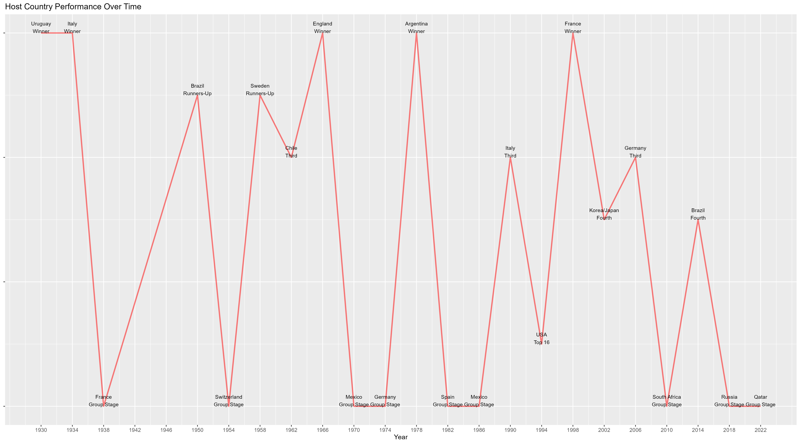

R_Script.R
================
hoang
2023-03-18

``` r
library(tidyverse)
library (readxl)
library(gridExtra)
library(ggrepel)

getwd()
```

    ## [1] "C:/Users/hoang/Documents/Data Related/Data Projects/World Cup/World+Cup"

``` r
#GGPLOT Theme Setting

#FIRST STEP: READING AND CLEANING DATA

#1 WC Events, Date, Time, Location
WC_Events_uncleaned <- read_csv("data/world_cups.csv",col_names= TRUE)
```

    ## Rows: 22 Columns: 9
    ## ── Column specification ─────────────────────────────────────────────────────────────────────────────────────────────────────────────────────────────────────────────────────────────────
    ## Delimiter: ","
    ## chr (5): Host Country, Winner, Runners-Up, Third, Fourth
    ## dbl (4): Year, Goals Scored, Qualified Teams, Matches Played
    ## 
    ## ℹ Use `spec()` to retrieve the full column specification for this data.
    ## ℹ Specify the column types or set `show_col_types = FALSE` to quiet this message.

``` r
head(WC_Events_uncleaned)
```

    ## # A tibble: 6 × 9
    ##    Year `Host Country` Winner     `Runners-Up`   Third   Fourth     `Goals Scored` `Qualified Teams` `Matches Played`
    ##   <dbl> <chr>          <chr>      <chr>          <chr>   <chr>               <dbl>             <dbl>            <dbl>
    ## 1  1930 Uruguay        Uruguay    Argentina      USA     Yugoslavia             70                13               18
    ## 2  1934 Italy          Italy      Czechoslovakia Germany Austria                70                16               17
    ## 3  1938 France         Italy      Hungary        Brazil  Sweden                 84                15               18
    ## 4  1950 Brazil         Uruguay    Brazil         Sweden  Spain                  88                13               22
    ## 5  1954 Switzerland    Germany FR Hungary        Austria Uruguay               140                16               26
    ## 6  1958 Sweden         Brazil     Sweden         France  Germany FR            126                16               35

``` r
#remove white space between column name

names(WC_Events_uncleaned) <- gsub(" ", "",colnames(WC_Events_uncleaned))


#pivot data to longer

WC_Events <- WC_Events_uncleaned %>%  pivot_longer(c(Winner, `Runners-Up`, Third, Fourth), names_to = "Standing", values_to = "Country")


#2 WC Matches

#The wC_Matches had not included results for WC 2022 joining the data with another one to retrieve the newest 2022 data

WC_Matches2022 <- read_csv("data/2022_world_cup_matches.csv", col_names = TRUE)
```

    ## Rows: 64 Columns: 8
    ## ── Column specification ─────────────────────────────────────────────────────────────────────────────────────────────────────────────────────────────────────────────────────────────────
    ## Delimiter: ","
    ## chr  (4): Stage, Home Team, Away Team, Win Condition
    ## dbl  (2): ID, Year
    ## lgl  (1): Host Team
    ## date (1): Date
    ## 
    ## ℹ Use `spec()` to retrieve the full column specification for this data.
    ## ℹ Specify the column types or set `show_col_types = FALSE` to quiet this message.

``` r
WC_MatchesB42022 <- read_csv("data/B42022_world_cup_matches.csv", col_names = TRUE)
```

    ## Rows: 900 Columns: 10
    ## ── Column specification ─────────────────────────────────────────────────────────────────────────────────────────────────────────────────────────────────────────────────────────────────
    ## Delimiter: ","
    ## chr  (4): Stage, Home Team, Away Team, Win Condition
    ## dbl  (4): ID, Year, Home Goals, Away Goals
    ## lgl  (1): Host Team
    ## date (1): Date
    ## 
    ## ℹ Use `spec()` to retrieve the full column specification for this data.
    ## ℹ Specify the column types or set `show_col_types = FALSE` to quiet this message.

``` r
head(WC_Matches2022)
```

    ## # A tibble: 6 × 8
    ##      ID  Year Date       Stage       `Home Team`   `Away Team` `Win Condition` `Host Team`
    ##   <dbl> <dbl> <date>     <chr>       <chr>         <chr>       <chr>           <lgl>      
    ## 1     1  2022 2022-11-20 Group stage Qatar         Ecuador     <NA>            TRUE       
    ## 2     2  2022 2022-11-21 Group stage Senegal       Netherlands <NA>            FALSE      
    ## 3     3  2022 2022-11-21 Group stage England       Iran        <NA>            FALSE      
    ## 4     4  2022 2022-11-21 Group stage United States Wales       <NA>            FALSE      
    ## 5     5  2022 2022-11-22 Group stage France        Australia   <NA>            FALSE      
    ## 6     6  2022 2022-11-22 Group stage Denmark       Tunisia     <NA>            FALSE

``` r
#Using the temp_data to join and retrieve the readable data
temp_data <- read_csv("data/Fifa_world_cup_matches.csv", col_names = TRUE)
```

    ## Rows: 64 Columns: 88
    ## ── Column specification ─────────────────────────────────────────────────────────────────────────────────────────────────────────────────────────────────────────────────────────────────
    ## Delimiter: ","
    ## chr   (7): team1, team2, possession team1, possession team2, possession in contest, date, category
    ## dbl  (80): number of goals team1, number of goals team2, total attempts team1, total attempts team2, conceded team1, conceded team2, goal inside the penalty area team1, goal inside ...
    ## time  (1): hour
    ## 
    ## ℹ Use `spec()` to retrieve the full column specification for this data.
    ## ℹ Specify the column types or set `show_col_types = FALSE` to quiet this message.

``` r
#Cleaning temp data to join converting data into lower case
temp_data$team1 <- str_to_title(tolower(temp_data$team1))
temp_data$team2 <- str_to_title(tolower(temp_data$team2))


#Joining and removing non-essential columns
                                            
WC_Matches2022 <- WC_Matches2022 %>% left_join(temp_data, by =c("Home Team"= "team1", "Away Team" = "team2")) %>% select(1:8, 12:13)

#Now Let's see what column this data have so we can rename column and do some cleaning

head(WC_Matches2022)
```

    ## # A tibble: 6 × 10
    ##      ID  Year Date       Stage       `Home Team`   `Away Team` `Win Condition` `Host Team` `number of goals team1` `number of goals team2`
    ##   <dbl> <dbl> <date>     <chr>       <chr>         <chr>       <chr>           <lgl>                         <dbl>                   <dbl>
    ## 1     1  2022 2022-11-20 Group stage Qatar         Ecuador     <NA>            TRUE                              0                       2
    ## 2     2  2022 2022-11-21 Group stage Senegal       Netherlands <NA>            FALSE                             0                       2
    ## 3     3  2022 2022-11-21 Group stage England       Iran        <NA>            FALSE                             6                       2
    ## 4     4  2022 2022-11-21 Group stage United States Wales       <NA>            FALSE                             1                       1
    ## 5     5  2022 2022-11-22 Group stage France        Australia   <NA>            FALSE                             4                       1
    ## 6     6  2022 2022-11-22 Group stage Denmark       Tunisia     <NA>            FALSE                             0                       0

``` r
#renaming column and relocate column and changing column type for union - here we can join Home goals with numberofgoalteam 1 and Away Goals with numberofgoalteam2
WC_Matches2022 <- WC_Matches2022 %>% rename('Home Goals' = 'number of goals team1', 'Away Goals' = 'number of goals team2') %>% relocate('Home Goals', .after = 'Home Team' ) 
WC_Matches2022 <- relocate(WC_Matches2022, 'Away Goals', .after = 'Away Team')
WC_Matches2022$`Home Goals` <- as.double(WC_Matches2022$`Home Goals`)
                               
#Now that the data is sharing the same format we can union
WC_Matches <- union_all(WC_MatchesB42022, WC_Matches2022)

#removing space between column
names(WC_Matches) <- gsub(" ", "",colnames(WC_Matches))


#let's take a look at the clean version
head(WC_Matches)
```

    ## # A tibble: 6 × 10
    ##      ID  Year Date       Stage       HomeTeam      HomeGoals AwayGoals AwayTeam WinCondition HostTeam
    ##   <dbl> <dbl> <date>     <chr>       <chr>             <dbl>     <dbl> <chr>    <chr>        <lgl>   
    ## 1     1  1930 1930-07-13 Group stage France                4         1 Mexico   <NA>         FALSE   
    ## 2     2  1930 1930-07-13 Group stage United States         3         0 Belgium  <NA>         FALSE   
    ## 3     3  1930 1930-07-14 Group stage Yugoslavia            2         1 Brazil   <NA>         FALSE   
    ## 4     4  1930 1930-07-14 Group stage Romania               3         1 Peru     <NA>         FALSE   
    ## 5     5  1930 1930-07-15 Group stage Argentina             1         0 France   <NA>         FALSE   
    ## 6     6  1930 1930-07-16 Group stage Chile                 3         0 Mexico   <NA>         FALSE

``` r
#3 International Matches - same logic

International_Matches <- read_csv("data/International_Matches.csv", col_names = TRUE)
```

    ## Rows: 17769 Columns: 9
    ## ── Column specification ─────────────────────────────────────────────────────────────────────────────────────────────────────────────────────────────────────────────────────────────────
    ## Delimiter: ","
    ## chr  (4): Tournament, Home Team, Away Team, Win Conditions
    ## dbl  (3): ID, Home Goals, Away Goals
    ## lgl  (1): Home Stadium
    ## date (1): Date
    ## 
    ## ℹ Use `spec()` to retrieve the full column specification for this data.
    ## ℹ Specify the column types or set `show_col_types = FALSE` to quiet this message.

``` r
names(International_Matches) <- gsub(" ", "",colnames(International_Matches))

head(International_Matches)
```

    ## # A tibble: 6 × 9
    ##      ID Tournament Date       HomeTeam HomeGoals AwayGoals AwayTeam WinConditions HomeStadium
    ##   <dbl> <chr>      <date>     <chr>        <dbl>     <dbl> <chr>    <chr>         <lgl>      
    ## 1     1 Friendly   1872-11-30 Scotland         0         0 England  <NA>          TRUE       
    ## 2     2 Friendly   1873-03-08 England          4         2 Scotland <NA>          TRUE       
    ## 3     3 Friendly   1874-03-07 Scotland         2         1 England  <NA>          TRUE       
    ## 4     4 Friendly   1875-03-06 England          2         2 Scotland <NA>          TRUE       
    ## 5     5 Friendly   1876-03-04 Scotland         3         0 England  <NA>          TRUE       
    ## 6     6 Friendly   1876-03-25 Scotland         4         0 Wales    <NA>          TRUE

``` r
#4 World cup Squads and Group

WC_Groups <- read_csv("data/2022_world_cup_groups.csv", col_names = TRUE)
```

    ## Rows: 32 Columns: 4
    ## ── Column specification ─────────────────────────────────────────────────────────────────────────────────────────────────────────────────────────────────────────────────────────────────
    ## Delimiter: ","
    ## chr (3): Group, Team, Final_Standing
    ## dbl (1): FIFA Ranking
    ## 
    ## ℹ Use `spec()` to retrieve the full column specification for this data.
    ## ℹ Specify the column types or set `show_col_types = FALSE` to quiet this message.

``` r
names(WC_Groups) <- gsub(" ", "",colnames(WC_Groups))

head(WC_Groups)
```

    ## # A tibble: 6 × 4
    ##   Group Team        FIFARanking Final_Standing
    ##   <chr> <chr>             <dbl> <chr>         
    ## 1 A     Qatar                50 Group Stage   
    ## 2 A     Ecuador              44 Group Stage   
    ## 3 A     Senegal              18 Top 16        
    ## 4 A     Netherlands           8 Top 8         
    ## 5 B     England               5 Top 8         
    ## 6 B     Iran                 20 Group Stage

``` r
#Moving on to the analysis steps, some of the insights we looking to answer
```

``` r
#1. Host Country Performance:

#Select the host country matches only
Host_Country_Matches <- filter(WC_Matches, HostTeam == TRUE)

head(Host_Country_Matches)
```

    ## # A tibble: 6 × 10
    ##      ID  Year Date       Stage          HomeTeam HomeGoals AwayGoals AwayTeam      WinCondition HostTeam
    ##   <dbl> <dbl> <date>     <chr>          <chr>        <dbl>     <dbl> <chr>         <chr>        <lgl>   
    ## 1     9  1930 1930-07-18 Group stage    Uruguay          1         0 Peru          <NA>         TRUE    
    ## 2    14  1930 1930-07-21 Group stage    Uruguay          4         0 Romania       <NA>         TRUE    
    ## 3    17  1930 1930-07-27 Semi-finals    Uruguay          6         1 Yugoslavia    <NA>         TRUE    
    ## 4    18  1930 1930-07-30 Final          Uruguay          4         2 Argentina     <NA>         TRUE    
    ## 5    25  1934 1934-05-27 Round of 16    Italy            7         1 United States <NA>         TRUE    
    ## 6    29  1934 1934-05-31 Quarter-finals Italy            1         1 Spain         <NA>         TRUE

``` r
#We use this data to find the furthest round that the host country make to

Host_Country_Best_Stage <- Host_Country_Matches %>% group_by(Year) %>% top_n(1,Date)

head(Host_Country_Best_Stage)
```

    ## # A tibble: 6 × 10
    ## # Groups:   Year [6]
    ##      ID  Year Date       Stage          HomeTeam    HomeGoals AwayGoals AwayTeam       WinCondition HostTeam
    ##   <dbl> <dbl> <date>     <chr>          <chr>           <dbl>     <dbl> <chr>          <chr>        <lgl>   
    ## 1    18  1930 1930-07-30 Final          Uruguay             4         2 Argentina      <NA>         TRUE    
    ## 2    35  1934 1934-06-10 Final          Italy               2         1 Czechoslovakia Extra time   TRUE    
    ## 3    48  1938 1938-06-12 Quarter-finals France              1         3 Italy          <NA>         TRUE    
    ## 4    75  1950 1950-07-16 Final round    Uruguay             2         1 Brazil         <NA>         TRUE    
    ## 5    95  1954 1954-06-26 Quarter-finals Switzerland         5         7 Austria        <NA>         TRUE    
    ## 6   136  1958 1958-06-29 Final          Sweden              2         5 Brazil         <NA>         TRUE

``` r
Host_Country_Best_Stage$Stage <- fct_recode(Host_Country_Best_Stage$Stage, "Final Round" ="Final", "Group Stage" = "Final round", "Group Stage" = "Second group stage", "Group Stage"="Group stage", "Quarter-final Round" = "Quarter-finals", "Round of 16" = "Round of 16", "Third-Fourth Round"= "Third place")


#We create a new column in that indicate whether the host country could make to the top 4 that year
WC_Events_Host_Standing<- WC_Events %>% 
  group_by(Year) %>%
  mutate(
    HostFinalStanding = if_else(
      HostCountry %in% head(Country, 4), 
      Standing, 
      "Out Top 4")) %>% 
  filter(HostCountry== Country | HostFinalStanding =="Out Top 4") %>% select(-Country, -Standing) %>% distinct()

head(WC_Events_Host_Standing)
```

    ## # A tibble: 6 × 6
    ## # Groups:   Year [6]
    ##    Year HostCountry GoalsScored QualifiedTeams MatchesPlayed HostFinalStanding
    ##   <dbl> <chr>             <dbl>          <dbl>         <dbl> <chr>            
    ## 1  1930 Uruguay              70             13            18 Winner           
    ## 2  1934 Italy                70             16            17 Winner           
    ## 3  1938 France               84             15            18 Out Top 4        
    ## 4  1950 Brazil               88             13            22 Runners-Up       
    ## 5  1954 Switzerland         140             16            26 Out Top 4        
    ## 6  1958 Sweden              126             16            35 Runners-Up

``` r
#In order to see host performance over time, create a numeric column that numerises the Host Final Standing in each WC

Host_Country_Data <- WC_Events_Host_Standing %>% 
  left_join(Host_Country_Best_Stage, by = "Year") 

Host_Country_Data <- Host_Country_Data %>% 
  mutate(HostFinalStandingDetailed = case_when(HostFinalStanding== "Out Top 4" ~ (case_match(as.character(Stage),"Quarter-finals" ~ "Top 8", "Round of 16" ~ "Top 16", "Final round"~ "Top 4", .default = "Group Stage")), .default = HostFinalStanding))
                             
Host_Country_Data <- Host_Country_Data %>% 
  mutate(HostFinalStandingNumber = case_match(HostFinalStandingDetailed, "Winner"~ 6,"Runners-Up" ~ 5, "Third" ~ 4, "Fourth" ~ 3,"Top 8" ~ 2, "Top 16"~1, .default=0))


#Let's graph the host country performance overtime
Host_Country_Performance_Chart <- ggplot(data = Host_Country_Data,mapping = aes( x = Year, y = HostFinalStandingNumber)) + geom_line(color = "red", size = 1, alpha = 0.5) + geom_text(aes(label = str_c(HostCountry,"\n", HostFinalStandingDetailed)), color = "black", vjust =0, size = 3) + theme(legend.position = "none") + ggtitle("Host Country Performance Over Time")  + scale_x_continuous(limits = c(1930, 2022), breaks = seq(1930,2022,4)) + theme(axis.title.y = element_blank(),axis.text.y = element_blank(), legend.position = "none")

ggsave("charts/Host_Country_Performance_Overtime.png", plot = Host_Country_Performance_Chart, width = 8, height = 6, units = "in")

Host_Country_Performance_Chart
```

<!-- -->

``` r
#Now Let's see how many times the host countries make it to each round in every WC
Host_Data_Summary <- fct_count(Host_Country_Data$HostFinalStandingDetailed) %>% rename(Standing = "f", Times = "n")

Host_Data_Summary$Standing <- fct_relevel (Host_Data_Summary$Standing,"Winner", "Runners-Up", "Third", "Fourth", "Top 8","Top 16", "Group Stage")
```

    ## Warning: 1 unknown level in `f`: Top 8

``` r
Host_Country_Performance_Summarize <- ggplot(data = Host_Data_Summary, aes(x = Standing, y = Times)) + 
  geom_bar(stat = "identity", aes(fill = Times), color = "black") + 
  scale_fill_gradient(low = "grey", high = "red") + 
  ggtitle("Host Country Performance Summary") +
  xlab("") +
  geom_text(aes(label = Times), position = position_stack(vjust = 0.8), fontface = "bold") +
  guides(fill = "none")

ggsave("charts/Host_Country_Performance_Summarize.png", plot = Host_Country_Performance_Summarize, width = 8, height = 6, units = "in")

Host_Country_Performance_Summarize
```

<!-- -->

``` r
#Next let's look at the Average Goal Scored and Average Goal Concede by each Host Country

Summarised_HostPerformance <- WC_Matches %>%
  filter(HostTeam==TRUE) %>%
  group_by(Year) %>%
  summarise(
    Average_Goal_Scored = mean(HomeGoals),
    Average_Goal_Conceded = mean(AwayGoals))


Summarised_QatarPerformance <- filter(Summarised_HostPerformance, Year == 2022 )
Qatar_Average_Goal_Scored <- Summarised_QatarPerformance$Average_Goal_Scored
Qatar_Average_Goal_Conceded <- Summarised_QatarPerformance$Average_Goal_Conceded


# Average Goal Scored Chart
Average_Goal_Scored <- ggplot(data = Summarised_HostPerformance, aes(x = Year, y = Average_Goal_Scored)) + 
  geom_line(color = "red", size = 1, alpha = 0.5) +
  ggtitle("Host Country Average Goal Scored Per Match") +
  theme(axis.title.y = element_text(size = 12), axis.text.y = element_text(size = 10)) +
  scale_x_continuous(limits = c(1930, 2022), breaks = seq(1930, 2022, 4)) +
  scale_y_continuous(breaks = seq(0, max(Summarised_HostPerformance$Average_Goal_Scored), 0.5)) +
  ylab("Average Goals") +
  xlab("Year") +
  geom_hline(aes(yintercept = Qatar_Average_Goal_Scored, linetype = "Average Goals Scored"), 
             color = "red", linetype = "dashed") +
  scale_linetype_manual(values=c("dashed"), guide = "none") +
  geom_label(aes(x = max(Year), y = Qatar_Average_Goal_Scored, label = "Qatar"), 
             color = "black", size = 4, vjust = 1, hjust = 0.2) +
  geom_text(aes(label = round(Average_Goal_Scored, 1)), nudge_y = 0.1, hjust = -0.2, size = 3.5) +
  theme(legend.position = "none")

ggsave("charts/Average_Goal_Scored_byHost.png", plot = Average_Goal_Scored, width = 8, height = 6, units = "in")

Average_Goal_Scored
```

<!-- -->

``` r
# Chart with only Average Goal Conceded
Average_Goal_Conceded <- ggplot(data = Summarised_HostPerformance, aes(x = Year, y = Average_Goal_Conceded)) + 
  geom_line(color = "blue", size = 1, alpha = 0.5) +
  ggtitle("Host Country Average Goal Conceded Per Match") +
  theme(axis.title.y = element_text(size = 12), axis.text.y = element_text(size = 10)) +
  scale_x_continuous(limits = c(1930, 2022), breaks = seq(1930, 2022, 4)) +
  scale_y_continuous(breaks = seq(0, max(Summarised_HostPerformance$Average_Goal_Conceded), 0.5)) +
  ylab("Average Goals Conceded") +
  xlab("Year") +
  geom_hline(aes(yintercept = Qatar_Average_Goal_Conceded, linetype = "Average Goals Conceded"), 
             color = "blue", linetype = "dashed") +
  scale_linetype_manual(values=c("dashed"), guide = "none") +
  geom_label(aes(x = max(Year), y = Qatar_Average_Goal_Conceded, label = "Qatar"), 
             color = "black", size = 4, vjust = 0.1, hjust = 0.2) +
  geom_text(aes(label = round(Average_Goal_Conceded, 1)), nudge_y = -0.1, hjust = -0.2, size = 3.5) +
  theme(legend.position = "none")

ggsave("charts/Average_Goal_Conceded_byHost.png", plot = Average_Goal_Conceded, width = 8, height = 6, units = "in")

Average_Goal_Conceded
```

<!-- -->

``` r
#2 Based on recent form and historical dominance which countries under performed and over performed


#Manipulate data to see historical dominance

head(WC_Events)
```

    ## # A tibble: 6 × 7
    ##    Year HostCountry GoalsScored QualifiedTeams MatchesPlayed Standing   Country       
    ##   <dbl> <chr>             <dbl>          <dbl>         <dbl> <chr>      <chr>         
    ## 1  1930 Uruguay              70             13            18 Winner     Uruguay       
    ## 2  1930 Uruguay              70             13            18 Runners-Up Argentina     
    ## 3  1930 Uruguay              70             13            18 Third      USA           
    ## 4  1930 Uruguay              70             13            18 Fourth     Yugoslavia    
    ## 5  1934 Italy                70             16            17 Winner     Italy         
    ## 6  1934 Italy                70             16            17 Runners-Up Czechoslovakia

``` r
WC_dominance_summary <- WC_Events %>%
  group_by(HostCountry, Standing) %>%
  count() %>%
  pivot_wider(names_from = Standing, values_from = n, values_fill = 0) %>% #transform this column values into multiple columns that count the number of times in top 4
  rename(Winner = "Winner", `Runners-Up` = "Runners-Up", Third = "Third", Fourth = "Fourth")

WC_dominance_summary <- WC_dominance_summary %>% mutate(Times_in_Top4 = rowSums(across(Winner:Fourth)))

head(WC_dominance_summary)
```

    ## # A tibble: 6 × 6
    ## # Groups:   HostCountry [6]
    ##   HostCountry Fourth `Runners-Up` Third Winner Times_in_Top4
    ##   <chr>        <int>        <int> <int>  <int>         <dbl>
    ## 1 Argentina        1            1     1      1             4
    ## 2 Brazil           2            2     2      2             8
    ## 3 Chile            1            1     1      1             4
    ## 4 England          1            1     1      1             4
    ## 5 France           2            2     2      2             8
    ## 6 Germany          2            2     2      2             8

``` r
#Let's graph the country that dominate in WC and their achievement:

WC_dominants <- WC_dominance_summary %>%
  pivot_longer(cols = -c(HostCountry,Times_in_Top4), names_to = "Place", values_to = "Sum") %>%
  mutate(Place = factor(Place, levels = c("Winner", "Runners-Up", "Third", "Fourth"))) %>%
  mutate(Country = fct_reorder(HostCountry, Sum, sum)) %>% 
  ggplot(aes(x = Country, y = Sum, fill = Place)) +
  geom_col(position = "stack", color = "black") +
  geom_text(aes(label = ifelse(Sum > 0, Sum, "")), position = position_stack(vjust = 0.5), size = 3) +
  coord_flip() +
  scale_fill_manual(values = c("#5DA5DA", "#FAA43A", "#60BD68", "#F17CB0")) +
  labs(x = "", y = "Performances", fill = "") +
  ggtitle("Top Performers in World Cup") +
  theme_minimal() + 
  scale_y_continuous(limits = c(0, 12), breaks = seq(0,12,2))

ggsave("charts/WC_dominants.png", plot = WC_dominants, width = 8, height = 6, units = "in")

WC_dominants
```

<!-- -->

``` r
#Moving on to each country recent competition form, we use the International Matches data

head(International_Matches)
```

    ## # A tibble: 6 × 9
    ##      ID Tournament Date       HomeTeam HomeGoals AwayGoals AwayTeam WinConditions HomeStadium
    ##   <dbl> <chr>      <date>     <chr>        <dbl>     <dbl> <chr>    <chr>         <lgl>      
    ## 1     1 Friendly   1872-11-30 Scotland         0         0 England  <NA>          TRUE       
    ## 2     2 Friendly   1873-03-08 England          4         2 Scotland <NA>          TRUE       
    ## 3     3 Friendly   1874-03-07 Scotland         2         1 England  <NA>          TRUE       
    ## 4     4 Friendly   1875-03-06 England          2         2 Scotland <NA>          TRUE       
    ## 5     5 Friendly   1876-03-04 Scotland         3         0 England  <NA>          TRUE       
    ## 6     6 Friendly   1876-03-25 Scotland         4         0 Wales    <NA>          TRUE

``` r
#Data Transformation
International_Matches_Transformed <- 
  International_Matches %>% pivot_longer(cols = c(HomeTeam, AwayTeam), names_to = "Home_Away", values_to = "Country") %>% #pivoting Home Team and Away Team to one column only
  mutate(Goal_Scored = ifelse (Home_Away == "HomeTeam", HomeGoals, AwayGoals)) %>% #Cleaning columns with conditions
  filter( Country %in% (WC_Groups$Team)) #keep countries in the WC team only

#Let's evaluate the recent form by keeping the only top 5 most recent matches for each country:
International_Matches_Transformed_latest5 <- International_Matches_Transformed %>%
  arrange(Country, Date) %>%  # sort by Country and Date
  group_by(Country) %>%
  slice_tail(n = 5)  # keep only the last 5 matches for each Country

#Based on the goal scored of home team and away team we can determine the result of the matches:
International_Matches_Transformed_latest5 <- International_Matches_Transformed_latest5 %>%
    mutate(Result = case_when(
    Home_Away == "HomeTeam" & HomeGoals > AwayGoals ~ "Win",
    Home_Away == "HomeTeam" & HomeGoals < AwayGoals ~ "Loss",
    Home_Away == "AwayTeam" & HomeGoals > AwayGoals ~ "Loss",
    Home_Away == "AwayTeam" & HomeGoals < AwayGoals ~ "Win",
    TRUE ~ "Draw"
  ))

#Using that result we assigned 3 points to a win, 1 point to a draw and 0 point to a loss for a country, the sum of point will be used to determine the recent form of a WC participants
International_Matches_Form <- International_Matches_Transformed_latest5 %>% select(Country, Result) %>% 
  mutate(Result_numeric = case_match(Result, "Win" ~ 3,  "Draw" ~ 1,  "Loss"  ~ 0)) %>%
  group_by(Country) %>%
  summarise(Total_point = sum(Result_numeric)) %>%
  mutate(Form_B4_WC = case_when(Total_point>10 ~ "A", Total_point <5 ~ "C", .default = "B"))%>%
  arrange(desc(Total_point))

#Let's view the Match form data after all these steps so far
head(International_Matches_Form)
```

    ## # A tibble: 6 × 3
    ##   Country     Total_point Form_B4_WC
    ##   <chr>             <dbl> <chr>     
    ## 1 Brazil               15 A         
    ## 2 Argentina            13 A         
    ## 3 Croatia              13 A         
    ## 4 Netherlands          13 A         
    ## 5 Senegal              13 A         
    ## 6 Serbia               13 A

``` r
WC_participants_recentform <-ggplot(data = International_Matches_Form, aes(x = Total_point, y = reorder(Country,Total_point), color = Form_B4_WC)) +
  geom_point(size = 4) +
  scale_color_manual(values = c("green", "blue", "red"), name = "Form_B4_WC") +
  labs(x = "Total Points", y = "Country", title = "Team Performance Summary Based on last 5 matches") +
  theme_bw() +
  scale_x_continuous(breaks = seq(0, 15, by = 2))

ggsave("charts/WC_participants_recentform.png", plot = WC_participants_recentform, width = 8, height = 6, units = "in")

WC_participants_recentform
```

<!-- -->

``` r
#Create a new tibble that join recent forms(numerical) to WC 2022 Countries
WC2022_Performance <-WC_Groups %>% left_join(International_Matches_Form, by = c("Team" = "Country")) %>% 
  left_join(WC_dominance_summary, by = c("Team" = "HostCountry")) %>%
  replace_na(list(Times_in_Top4 = 0)) %>%
  arrange(Team) %>% 
  mutate(Final_Standing_numeric = case_match(Final_Standing,"Winner" ~ 1, "Runners-Up"~2,"Third Place" ~ 3, "Fourth Place" ~ 4, "Top 8" ~ 5, "Top 16" ~ 6, .default = 7)) # numerise the final standing of WC2022 participants to display on graph 

WC2022_Performance$Final_Standing <- factor(WC2022_Performance$Final_Standing, levels = c("Group Stage", "Top 16", "Top 8", "Fourth Place", "Third Place", "Runners-Up", "Winner"))


WC_participants_Standing_vsForm <-ggplot(data = WC2022_Performance, aes(x = Final_Standing, y = Times_in_Top4, label = Team)) +
  geom_point(size =2 , color = "black") +
  ggrepel::geom_text_repel(aes(color = Form_B4_WC), size = 4, show.legend = TRUE, max.overlaps = Inf, nudge_x = 0.2, nudge_y = 0.2) +
  scale_color_manual(values = c("green", "blue", "red"), name = "Form_B4_WC") +
  labs(x = "Final Standing", y = "Times in Top 4", title = "Team Performance Summary Based on last 5 matches") +
  theme_bw() +
  scale_x_discrete(limits = c("Group Stage", "Top 16", "Top 8", "Fourth Place", "Third Place", "Runners-Up", "Winner"))

ggsave("charts/WC_participants_Standing_vsForm.png", plot = WC_participants_Standing_vsForm, width = 8, height = 6, units = "in")

WC_participants_Standing_vsForm
```

<!-- -->

``` r
#3 Argentina 2022 road to glory compare to France 2018

#Let's filter for Argentina and Frances matches only
WC_Matches_Transformed <- 
  WC_Matches %>% pivot_longer(cols = c(HomeTeam, AwayTeam), names_to = "Home_Away", values_to = "Country") %>%
  mutate(Goal_Scored = ifelse (Home_Away == "HomeTeam", HomeGoals, AwayGoals)) %>%
  filter((Country == "France" & Year == 2018) | (Country =="Argentina" & Year == 2022))

#See above for transformation logic
WC_Matches_Transformed <- WC_Matches_Transformed %>%
  mutate(Result = case_when(
    Home_Away == "HomeTeam" & HomeGoals > AwayGoals ~ "Win",
    Home_Away == "HomeTeam" & HomeGoals < AwayGoals ~ "Loss",
    Home_Away == "AwayTeam" & HomeGoals > AwayGoals ~ "Loss",
    Home_Away == "AwayTeam" & HomeGoals < AwayGoals ~ "Win",
    TRUE ~ "Draw")) %>%
  mutate(Result_numeric_streak = case_match(Result, "Win" ~ 1,  "Draw" ~ 0,  "Loss"  ~ -1)) %>%
  arrange(Country,Date) %>%
  group_by(Country) %>%
  mutate(match_index = row_number())


# plot Year vs. Result_Numeric with Country as the grouping variable
Road_to_Glory <- ggplot(WC_Matches_Transformed, aes(x = match_index, y = Result_numeric_streak, color = Country)) +
  geom_line(size = 1) + geom_point(size =2) +
  geom_text(aes(label = paste(Result, ifelse(is.na(WinCondition),"",WinCondition), sep = "\n")), 
            hjust = -0.1, size = 3, show.legend = FALSE, color = "black")  +
  labs(title = "Road to glory Argentina 2022 vs 2018 France",
       x = "Match Index",
       y = "Result",
       color = "Country") +
  scale_color_manual(values = c("#75AADB", "darkblue")) +
  facet_wrap(~Country, ncol = 2) +
  theme(axis.text.y = element_blank())

ggsave("charts/Road_to_Glory.png", plot = Road_to_Glory, width = 8, height = 6, units = "in")

Road_to_Glory
```

<!-- -->

``` r
#Let's compare the number of Goal Scored and Conceded between the two Countries

head(WC_Matches_Transformed)
```

    ## # A tibble: 6 × 14
    ## # Groups:   Country [1]
    ##      ID  Year Date       Stage          HomeGoals AwayGoals WinCondition                      HostTeam Home_Away Country   Goal_Scored Result Result_numeric_streak match_index
    ##   <dbl> <dbl> <date>     <chr>              <dbl>     <dbl> <chr>                             <lgl>    <chr>     <chr>           <dbl> <chr>                  <dbl>       <int>
    ## 1     8  2022 2022-11-22 Group stage            1         2 <NA>                              FALSE    HomeTeam  Argentina           1 Loss                      -1           1
    ## 2    24  2022 2022-11-26 Group stage            2         0 <NA>                              FALSE    HomeTeam  Argentina           2 Win                        1           2
    ## 3    39  2022 2022-11-30 Group stage            0         2 <NA>                              FALSE    AwayTeam  Argentina           2 Win                        1           3
    ## 4    50  2022 2022-12-03 Round of 16            2         1 <NA>                              FALSE    HomeTeam  Argentina           2 Win                        1           4
    ## 5    58  2022 2022-12-09 Quarter-finals         2         2 Argentina win on penalties (3 -4) FALSE    AwayTeam  Argentina           2 Draw                       0           5
    ## 6    61  2022 2022-12-13 Semi-finals            3         0 <NA>                              FALSE    HomeTeam  Argentina           3 Win                        1           6

``` r
Total_Goal_Scored <- WC_Matches_Transformed %>%
  group_by(Country) %>%
  summarize(Total_Goals_Scored = sum(ifelse(Home_Away == "HomeTeam", HomeGoals, AwayGoals)),
            Total_Goals_Conceded = sum(ifelse(Home_Away == "HomeTeam", AwayGoals, HomeGoals))) %>%
  ggplot(aes(x = Country, y = Total_Goals_Scored, fill = Country)) +
  geom_col(position = "dodge") +
  geom_text(aes(label=Total_Goals_Scored), position=position_dodge(width=0.9), vjust=-0.5) +
  facet_wrap(~ .) +
  labs(title = "Total Goals Scored",
       x = NULL, y = NULL) +
  guides(fill=FALSE) +
  scale_fill_manual(values = c("#75AADB", "darkblue")) +
  theme_bw() +
  theme(panel.grid.major = element_blank(),
        panel.grid.minor = element_blank(),
        panel.background = element_blank(),
        axis.line = element_line(colour = "black"))

ggsave("charts/Total_Goal_Scored_FranceArgentina.png", plot = Total_Goal_Scored, width = 8, height = 6, units = "in")


Total_Goal_Conceded <- WC_Matches_Transformed %>%
  group_by(Country) %>%
  summarize(Total_Goals_Scored = sum(ifelse(Home_Away == "HomeTeam", HomeGoals, AwayGoals)),
            Total_Goals_Conceded = sum(ifelse(Home_Away == "HomeTeam", AwayGoals, HomeGoals))) %>%
  ggplot(aes(x = Country, y = Total_Goals_Conceded, fill = Country)) +
  geom_col(position = "dodge") +
  geom_text(aes(label=Total_Goals_Conceded), position=position_dodge(width=0.9), vjust=-0.5) +
  facet_wrap(~ .) +
  labs(title = "Total Goals Conceded",
       x = NULL, y = NULL) +
  guides(fill=FALSE) +
  scale_fill_manual(values = c("#75AADB", "darkblue")) +
  theme_bw() +
  theme(panel.grid.major = element_blank(),
        panel.grid.minor = element_blank(),
        panel.background = element_blank(),
        axis.line = element_line(colour = "black"))

ggsave("charts/Total_Goal_Conceded_FranceArgentina.png", plot = Total_Goal_Conceded , width = 8, height = 6, units = "in")

grid.arrange(Total_Goal_Scored + scale_y_continuous(limits = c(0, 20), expand = c(0, 0)), 
             Total_Goal_Conceded + scale_y_continuous(limits = c(0, 20), expand = c(0, 0)), 
             ncol = 2, widths = c(4, 4), top = "Argentina vs France World Cup Stats")
```

<!-- -->

``` r
#rmarkdown::render("R_Script.R", "github_document")
```
